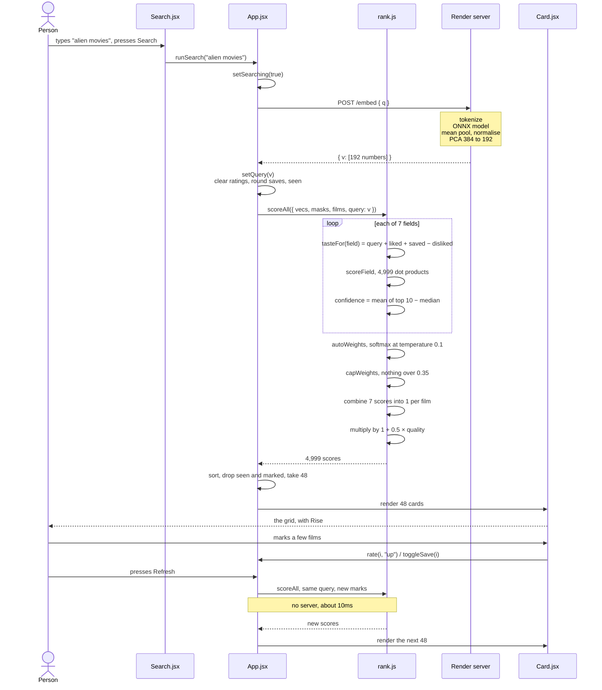

```mermaid
sequenceDiagram
    actor U as Person
    participant S as Search.jsx
    participant A as App.jsx
    participant R as rank.js
    participant V as Render server
    participant C as Card.jsx

    U->>S: types "alien movies", presses Search
    S->>A: runSearch("alien movies")
    A->>A: setSearching(true)

    A->>V: POST /embed { q }
    Note over V: tokenize<br/>ONNX model<br/>mean pool, normalise<br/>PCA 384 to 192
    V-->>A: { v: [192 numbers] }

    A->>A: setQuery(v)<br/>clear ratings, round saves, seen
    A->>R: scoreAll({ vecs, masks, films, query: v })

    loop each of 7 fields
        R->>R: tasteFor(field) = query + liked + saved − disliked
        R->>R: scoreField, 4,999 dot products
        R->>R: confidence = mean of top 10 − median
    end

    R->>R: autoWeights, softmax at temperature 0.1
    R->>R: capWeights, nothing over 0.35
    R->>R: combine 7 scores into 1 per film
    R->>R: multiply by 1 + 0.5 × quality
    R-->>A: 4,999 scores

    A->>A: sort, drop seen and marked, take 48
    A->>C: render 48 cards
    C-->>U: the grid, with Rise

    U->>C: marks a few films
    C->>A: rate(i, "up") / toggleSave(i)

    U->>A: presses Refresh
    A->>R: scoreAll, same query, new marks
    Note over A,R: no server, about 10ms
    R-->>A: new scores
    A->>C: render the next 48
```
